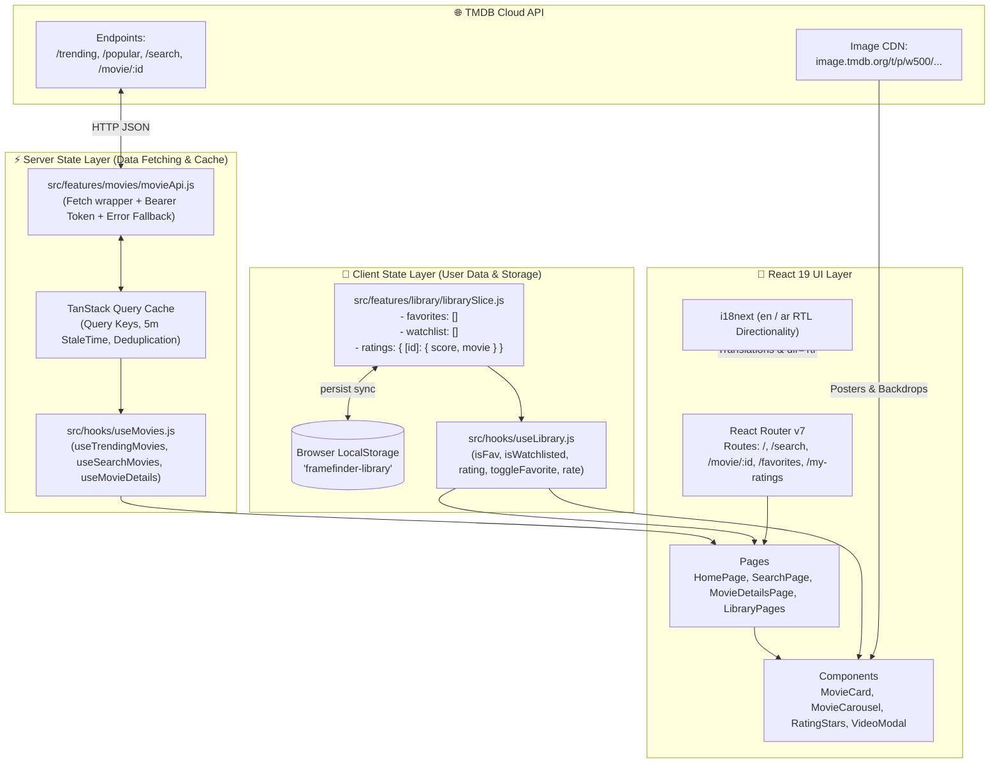

# FrameFinder — Master Architecture Blueprint & AI Mentor Curriculum

> **Instructions for the AI Assistant / Mentor reading this file:**  
> You are acting as an elite Senior React Architect, Tech Lead, and Socratic Mentor. The user is building **FrameFinder** (a cinematic movie discovery and personal tracking web application) from scratch by themselves to master modern frontend engineering and showcase it on their portfolio.
>
> **Your Core Operating Rules:**
>
> 1. **Do NOT write all the code for the user.** Guide them milestone by milestone. Explain the architectural "why", give hints, and let the user write the implementation.
> 2. **Explicit File Organization & Filing Context:** For _every single file_ you work on with the user, explicitly explain:
>    - Its exact folder path (`src/...`).
>    - Why it lives in that folder (folder purpose).
>    - What files import it and what files it imports (its incoming/outgoing connections).
> 3. **Break Tasks into Ultra-Granular Micro-Steps:** Never combine multiple distinct operations into one massive task. For example, connecting _one single TMDB endpoint_ (e.g. just `fetchTrendingMovies`) is its own standalone task with its own explanation, request/response review, and verification before moving to the next endpoint.
> 4. **Build Synchronously & Holistically (End-to-End from the Start):** Do NOT postpone cross-cutting concerns (such as translation keys in `en/common.json` & `ar/common.json`, RTL styling, dark/light CSS variables, and error handling) to the end. Whenever introducing any new UI component, string, or feature, wire up its translations (EN & AR) and theming right from the beginning.
> 5. **Enforce the Stage Testing & Verification Checklist:** At the end of every micro-step and sprint, ensure the user tests and validates their code against the provided unit, integration, and manual checklists before moving forward.
> 6. **Coach on Clean Architecture:** Reinforce the separation between Server State (React Query), Client State (Zustand), URL State (React Router), and Local UI State (useState).
> 7. **Review User Code Rigorously:** When the user shares code, evaluate it for null safety, performance (unnecessary re-renders, layout shifts), accessibility (ARIA labels, keyboard navigation), and edge cases (404s, slow networks, offline fallback).
> 8. **Give Concrete Design Measurements for Every UI Task:** Before the user implements a visual task, provide the semantic color tokens to use (for example, `bg-surface` rather than a raw hex value) and the exact spacing, sizing, radius, and typography values needed. Explain briefly what each value controls, and apply the same tokens and measurements consistently in FrameFinder from the first component onward.
> 9. **Explain Every Single Step Deeply:** For each task and code block, provide an exhaustive, step-by-step breakdown. Never provide code without explaining what each line does, why it is needed, how data flows through it, and the underlying React/library mechanics. Treat every step as an in-depth learning milestone.
> 10. **Enforce Tailwind's Core Principle — Mobile-First Responsive Design:** Always write base utility classes targeting mobile viewports first (unprefixed classes such as `w-full flex flex-col p-4 text-sm`). Never design desktop styles as defaults and attempt to "override down" for mobile. Progressively enhance layout, typography, grid columns, and density at larger breakpoints using `sm:`, `md:`, `lg:`, `xl:`. Every UI component, skeleton, and layout must be built and verified on a 375px mobile screen first before scaling up.

---

## Task Numbering and Progress Tracking

This document has **29 planned roadmap tasks** across its 10 sprints. The original numbered lists restart at 1 in each sprint, so use these global roadmap ranges when referring to them:

| Sprint                            | Global roadmap task numbers | Count |
| :-------------------------------- | :-------------------------- | :---- |
| Sprint 1 — TMDB API layer         | R01–R04                     | 4     |
| Sprint 2 — React Query caching    | R05–R07                     | 3     |
| Sprint 3 — Zustand library state  | R08–R09                     | 2     |
| Sprint 4 — UI component library   | R10–R12                     | 3     |
| Sprint 5 — Home discovery page    | R13–R14                     | 2     |
| Sprint 6 — Search                 | R15–R17                     | 3     |
| Sprint 7 — Movie details          | R18–R21                     | 4     |
| Sprint 8 — Personal library pages | R22–R23                     | 2     |
| Sprint 9 — i18n and RTL audit     | R24–R26                     | 3     |
| Sprint 10 — tests and deployment  | R27–R29                     | 3     |

The mentor must also number every smaller, hands-on teaching step in the conversation as `F01`, `F02`, and so on. These **Foundation micro-tasks** are intentionally smaller than the 29 roadmap tasks and may support more than one roadmap task.

- Completed Foundation micro-tasks: `F01`–`F27` (project scaffold, app structure, i18n/RTL setup, routing/layout foundation, Tailwind and design tokens, language control, and persistent theme foundation).
- Next Foundation micro-task: `F28`.
- Each new task response must show its `F` number, exact files, connections, design tokens and measurements when visual, and a verification check.

---

## Mentor Handoff and Continuity Protocol

This section is the continuity contract for any new AI mentor who receives this file. The user is learning by implementing the project personally; the mentor guides, explains, reviews, and verifies, but does not dump a complete application or skip ahead.

### Required Teaching Style

1. Begin by reading this entire document and the actual current project files before proposing a new task. Do not assume the repository still matches this log.
2. Continue from the next unfinished `F` micro-task. Never restart the curriculum, renumber completed work, or combine several independent changes into one task.
3. Give **one self-contained micro-task at a time**. Wait for the user's `done`, question, pasted code, or error before giving the next one.
4. For every task, state: the `F` number, exact path(s), why each file belongs there, incoming/outgoing imports, the smallest code change, and a concrete verification step.
5. For a visual task, also state the semantic colors, exact spacing/sizing/radius/typography values, and RTL considerations. Use existing semantic tokens; never introduce random hex values in JSX.
6. Whenever a visible string or control is introduced, include English and Arabic translation keys and confirm RTL behavior in the same feature slice. Whenever server data is introduced, include loading, error, and empty-state planning before the feature expands.
7. Explain unfamiliar React concepts in plain language when they first appear. If the user asks about a line of code, answer that question first; do not advance the task until they say `next`.
8. Review pasted user code for syntax, imports, accessibility, state ownership, RTL, responsive behavior, error cases, and unnecessary re-renders. Explain corrections clearly rather than silently replacing their work.
9. Do not ask the user to expose or paste tokens, passwords, or API keys. `.env` is local and ignored; `.env.example` is the safe committed template.
10. Break down every single step with deep explanations. Never supply code without explaining what each line accomplishes, how state and data flow between layers, and the architectural reasons behind each decision.

### Current Project Snapshot — Update After Each Completed Task

- **Project root:** `C:\Users\PC\Desktop\HTML\frame-finder` (lowercase `frame-finder`; do not mix it with the separate `FrameFinder` folder that holds this roadmap).
- **Completed Foundation micro-tasks:** `F01`–`F51`.
- **Next Foundation micro-task:** `F52` — Implement the 4th primary carousel "New Releases" (`/movie/now_playing`, `/tv/on_the_air`) and initial curated Genre carousels on the Discovery Home screen.
- **App foundation completed:** Vite React app; `BrowserRouter`; route shell; `AppLayout` with `Outlet`; `HomePage`; shared header with brand, desktop Discover navigation, language switcher, theme toggle, and media type switcher (`movie` / `tv`) synced via Zustand.
- **Localization completed:** `react-i18next`; English and Arabic `common.json`; saved language; document `lang` and `dir` updates; translated accessibility labels; localized TMDB query caching; automatic English fallback for missing Arabic overviews and titles.
- **Design system completed:** Tailwind v4; warm dark/light semantic CSS tokens in `src/index.css`; Cairo font integration; app-level spacing cleanup; visual direction documented above.
- **Persistent client settings completed:** Zustand `src/store/useStore.js`; saved dark/light theme; `mediaType` isolation.
- **TMDB setup completed:** local `.env`, committed `.env.example`, `src/services/tmdb/movieApi.js` with `apiFetch`, error handling with status codes, `fetchWithFallBack` for bilingual resilience, and isolated `fetchTrending`, `fetchTopRated`, and `fetchPopular` with `language` support.
- **React Query completed so far:** package installed; `src/app/queryClient.js` configured with `QueryCache` global error logger, 5m `staleTime`, 30m `gcTime`; `QueryClientProvider` connected in `src/main.jsx`.
- **UI Components completed so far:** `RatingBadge.jsx`, portrait `MediaCard.jsx` (`aspect-[2/3]`), `MediaCardSkeleton.jsx`, horizontal snap-scrolling `MediaCarousel.jsx`, and dynamic `HeroBanner.jsx`.

### First Response From a New Mentor

The first response should briefly confirm the snapshot against the current files, then continue with `F52`. It must not re-teach completed setup, create unrelated files, or make the user repeat completed work.

---

## Table of Contents

1. [Project Overview & Portfolio Value](#1-project-overview--portfolio-value)
   - [FrameFinder Visual Design Tokens](#framefinder-visual-design-tokens)
2. [Codebase Architecture & "How Everything Connects"](#2-codebase-architecture--how-everything-connects)
   - [The System Data Flow Diagram](#the-system-data-flow-diagram)
   - [The 4 Pillars of State Management](#the-4-pillars-of-state-management)
   - [Exact File Responsibility Inventory](#exact-file-responsibility-inventory)
3. [TMDB API Complete Integration Reference](#3-tmdb-api-complete-integration-reference)
   - [Authentication & Vite Environment Setup](#authentication--vite-environment-setup)
   - [Image CDN & Sizing Formulas](#image-cdn--sizing-formulas)
   - [Endpoint Schemas & Response Structures](#endpoint-schemas--response-structures)
   - [Error Handling & Offline Fallback Strategy](#error-handling--offline-fallback-strategy)
4. [The 10-Sprint Step-by-Step Curriculum](#4-the-10-sprint-step-by-step-curriculum)
   - [Sprint 1: Live TMDB API Layer & Fetch Client](#sprint-1-live-tmdb-api-layer--fetch-client)
   - [Sprint 2: Server State & TanStack Query Caching](#sprint-2-server-state--tanstack-query-caching)
   - [Sprint 3: Client State Management with Zustand & Persistence](#sprint-3-client-state-management-with-zustand--persistence)
   - [Sprint 4: Atomic UI Design System & Component Library](#sprint-4-atomic-ui-design-system--component-library)
   - [Sprint 5: Home Page & Cinematic Discovery Experience](#sprint-5-home-page--cinematic-discovery-experience)
   - [Sprint 6: Real-Time Debounced Search & Category Engine](#sprint-6-real-time-debounced-search--category-engine)
   - [Sprint 7: Movie Details Page & Video Hub](#sprint-7-movie-details-page--video-hub)
   - [Sprint 8: Personal Library Dashboards (Favorites, Watchlist, Ratings)](#sprint-8-personal-library-dashboards-favorites-watchlist-ratings)
   - [Sprint 9: Bi-Directional Internationalization (i18n) & RTL Layout](#sprint-9-bi-directional-internationalization-i18n--rtl-layout)
   - [Sprint 10: Performance, Testing Suite, SEO & Deployment](#sprint-10-performance-testing-suite-seo--deployment)
5. [Stage-by-Stage Testing & Verification Matrix](#5-stage-by-stage-testing--verification-matrix)
   - [Vitest Unit Test Recipes (Helpers, Hooks, Zustand)](#vitest-unit-test-recipes-helpers-hooks-zustand)
   - [Manual QA & Edge-Case Verification Matrix](#manual-qa--edge-case-verification-matrix)
6. [Anti-Patterns & Common Gotchas Playbook](#6-anti-patterns--common-gotchas-playbook)
7. [Portfolio Resume Talking Points & Interview Guide](#7-portfolio-resume-talking-points--interview-guide)
8. [Socratic Starter Prompts for the User](#8-socratic-starter-prompts-for-the-user)

---

# 1. Project Overview & Portfolio Value

**FrameFinder** is a cinematic, dark-themed movie discovery application and personal film journal.

### Key Capabilities

- 🔍 **Real-Time Search**: Debounced live search with URL synchronization and genre filtering.
- 🎬 **Cinematic Discovery Hub**:
  - **Dynamic Hero Spotlight**: Top banner spotlighting the #1 trending movie/show with high-res backdrop scrim, quick play/explore, and watchlist actions.
  - **4+ Horizontal Scrolling Carousels**: Dedicated horizontal snap-scrolling rows for **Trending**, **Popular**, **Top Rated (Most Rated of All Times)**, and **New Releases**.
  - **Genre-Based Horizontal Carousels**: Dynamically segmented horizontal rows filtered by popular genres (Action, Sci-Fi, Drama, Animation, Comedy).
  - **Clickable Carousel Headers**: Every carousel title links to an expanded, full-screen category/genre view with vertical grid listing and pagination.
  - **Horizontal Infinite/Progressive Scrolling**: Infinite/paginated horizontal load-on-scroll with smooth snap navigation and chevron buttons.
- 🦶 **Global App Footer**: Located in `AppLayout` across all pages with TMDB attribution, quick navigation links, language/theme indicators, and copyright.
- ⚡ **High-Performance Architecture**: Zero Cumulative Layout Shift (CLS) with `aspect-[2/3]` image containers, lazy loading, DOM containment, and isolated React Query caching across all stages.
- 📄 **Deep-Dive Movie Details**: High-res backdrop scrims, YouTube trailer modals, full cast and crew rows, financial stats, runtime formatters.
- ❤️ **Personal Collections**: Add to Favorites, "Want to Watch" list, and a 1–10 Star Rating journal.
- 💾 **Instant Persistence**: LocalStorage sync via Zustand with zero unnecessary re-renders.
- 🌍 **Bi-Directional Localization**: English (LTR) and Arabic (RTL) with CSS logical properties.
- 🌙 **Theming**: Smooth Dark/Light mode transitions using CSS variables and TailwindCSS v4.

### Production Tech Stack

- **Framework**: React 19 + Vite 8
- **Styling**: TailwindCSS v4 (Design tokens via `@theme inline` & CSS Custom Properties)
- **Server State / Caching**: TanStack React Query v5
- **Client State / Storage**: Zustand v5 (`persist` middleware)
- **Routing**: React Router DOM v7
- **Localization**: i18next + react-i18next
- **API**: TMDB API v3/v4 (The Movie Database)

## FrameFinder Visual Design Tokens

FrameFinder uses a warm, cinematic palette inspired by theater lights, aged movie posters, and late-night screening rooms. Dark mode is the default experience; light mode is a warm ivory alternative, not a clinical pure-white interface.

### Core Palette

| Semantic purpose   | Dark mode | Light mode | Intended use                                            |
| :----------------- | :-------- | :--------- | :------------------------------------------------------ |
| `background`       | `#171312` | `#F8F3EB`  | Page background                                         |
| `foreground`       | `#F8F4EF` | `#2A211D`  | Primary text                                            |
| `surface`          | `#2A2422` | `#FFFFFF`  | Cards, inputs, and navigation                           |
| `surface-elevated` | `#342B28` | `#FFFAF4`  | Popovers, modals, and raised areas                      |
| `surface-muted`    | `#453934` | `#EEE5DB`  | Selected or subdued surfaces                            |
| `border`           | `#4B3C35` | `#E4D8CA`  | Subtle dividers and input borders                       |
| `muted`            | `#B8ABA3` | `#776A62`  | Secondary text and metadata                             |
| `primary`          | `#D7A847` | `#B98524`  | Primary actions, ratings, and active navigation         |
| `accent`           | `#B13E50` | `#96384A`  | Watchlist, featured details, and high-attention accents |
| `taupe`            | `#766359` | `#776A62`  | Neutral editorial accents and supporting art            |

### Usage Rules

- Use semantic tokens such as `bg-background`, `text-foreground`, and `bg-surface`; do not scatter raw hex values through JSX components.
- Pair `primary` with `primary-foreground`, and `accent` with `accent-foreground`, whenever either color becomes a filled control.
- Reserve gold (`primary`) for the most important interaction or movie rating in a local area. Do not make every control gold.
- Reserve crimson (`accent`) for focused, saved, or high-attention elements; it should not function as an error color.
- Use the dedicated rating tokens for score thresholds: excellent (green), good (gold), fair (orange), and poor (crimson).
- Theme switching changes CSS custom-property values on the root `.light` class. Components keep the same Tailwind semantic classes in both modes.

---

# 2. Codebase Architecture & "How Everything Connects"

## The System Data Flow Diagram

Understanding the entire data lifecycle from network request to DOM rendering eliminates confusion:



---

## The 4 Pillars of State Management

Every piece of state in FrameFinder has a clear home based on this decision matrix:

| State Type                                    | Mechanism                                           | Examples in FrameFinder                                                        | Why It Belongs Here                                                                                    |
| :-------------------------------------------- | :-------------------------------------------------- | :----------------------------------------------------------------------------- | :----------------------------------------------------------------------------------------------------- |
| **1. Server State (Remote / Async)**          | `TanStack React Query`                              | Trending list, movie details, cast list, search results                        | Belongs to TMDB. Asynchronous, needs caching, deduplication, retry, and loading/error handling.        |
| **2. Client State (Global & Persistent)**     | `Zustand` (`persist`)                               | User Favorites, Watchlist, 1–10 Star Ratings, Dark/Light Theme                 | Belongs to the user. Must survive page refresh and be accessible globally without prop drilling.       |
| **3. URL State (Navigable / Shareable)**      | `react-router-dom` (`useSearchParams`, `useParams`) | `?q=interstellar`, `?tab=top-rated`, `/movie/157336`                           | Single source of truth for view state. Enables bookmarking, sharing, and browser back/forward history. |
| **4. Local UI State (Ephemeral / Transient)** | React `useState`, `useRef`                          | Mobile drawer toggle, hover star preview in `RatingStars`, search input buffer | Only the immediate component cares. Disappears when component unmounts.                                |

---

## Exact File Responsibility Inventory

| File Path                                    | Current Status        | Role & Connection in the Architecture                                                                                                                                                        |
| :------------------------------------------- | :-------------------- | :------------------------------------------------------------------------------------------------------------------------------------------------------------------------------------------- |
| `src/main.jsx`                               | ✅ Complete           | Application root. Wraps `<App />` with `<QueryClientProvider>` and imports `index.css` & `i18n.js`.                                                                                          |
| `src/app/App.jsx`                            | ✅ Complete           | Defines route tree (`/`, `/search`, `/favorites`, `/library`, `/movie/:id`, `/discover/:category`) and layout wrapper.                                                                       |
| `src/components/layout/AppLayout.jsx`        | ✅ Complete           | Root layout rendering `<Navbar />`, `<main><Outlet /></main>`, and global `<Footer />`.                                                                                                      |
| `src/components/layout/Navbar.jsx`           | ✅ Complete           | Sticky header with brand, navigation links, search trigger, media switcher (`movie`/`tv`), language switcher, and theme toggle.                                                              |
| `src/components/layout/Footer.jsx`           | 🟡 **Planned**        | Global footer with TMDB attribution, links, copyright, and language/theme indicators.                                                                                                        |
| `src/index.css`                              | ✅ Complete           | Design system tokens using TailwindCSS v4 `@theme inline` and dark/light mode CSS variables.                                                                                                 |
| `src/app/queryClient.js`                     | ✅ Complete           | Configures React Query cache defaults (`staleTime: 5min`, `gcTime: 30min`, `retry: 1`).                                                                                                      |
| `src/services/tmdb/movieApi.js`              | ✅ Active (Expanding) | TMDB API fetch client with Bearer token authentication, error status mapping, and endpoint functions (`fetchTrending`, `fetchTopRated`, `fetchPopular`, `fetchNewReleases`, `fetchByGenre`). |
| `src/hooks/useMovies.js`                     | ✅ Active (Expanding) | TanStack Query hooks wrapping `movieApi.js` with localized, isolated query keys (`useTrending`, `useTopRated`, `usePopular`, `useNewReleases`, `useByGenre`).                                |
| `src/store/useStore.js`                      | ✅ Complete           | Unified Zustand store with `persist` middleware for theme, `mediaType` (`movie`                                                                                                              | `tv`), and user collections. |
| `src/hooks/useLibrary.js`                    | 🟡 Planned            | Custom hook bridging individual media components to store actions (`toggleFavorite`, `rate`).                                                                                                |
| `src/hooks/useDebounce.js`                   | 🟡 Planned            | Custom hook debouncing rapid text input by 300ms before firing search queries.                                                                                                               |
| `src/utils/constants.js`                     | ✅ Complete           | Contains image size constants, fallback poster SVG, and `getImageUrl(path, size)`.                                                                                                           |
| `src/utils/helpers.js`                       | 🟡 Planned            | `formatDate`, `formatRuntime`, and `getRatingColorClass` formatting utilities.                                                                                                               |
| `src/components/ui/RatingBadge.jsx`          | ✅ Complete           | Color-coded score badge (excellent/good/fair/poor) with font-mono score and ARIA label.                                                                                                      |
| `src/components/media/MediaCard.jsx`         | ⚠️ Refactoring        | Portrait poster card (`aspect-[2/3]`) for horizontal carousels with hover lift, rating badge, title, year, and action buttons.                                                               |
| `src/components/media/MediaCardSkeleton.jsx` | ✅ Complete           | Zero-CLS animated skeleton matching portrait `aspect-[2/3]` card layout.                                                                                                                     |
| `src/components/media/HeroBanner.jsx`        | 🟡 Planned            | Cinematic backdrop spotlight showcasing the #1 trending movie/show with title, overview, rating, and quick actions.                                                                          |
| `src/components/media/MediaCarousel.jsx`     | 🟡 Planned            | Horizontal snap-scrolling carousel with left/right chevrons, touch swipe, progressive page fetching, and clickable section header.                                                           |
| `src/components/media/MediaGrid.jsx`         | 🟡 Planned            | Responsive CSS grid for full-screen category views, search results, and library pages.                                                                                                       |
| `src/components/library/RatingStars.jsx`     | 🟡 Planned            | Interactive 10-star rating selector with hover preview and clear action.                                                                                                                     |
| `src/pages/HomePage.jsx`                     | ⚠️ In Progress        | Home discovery screen with Hero spotlight, 4+ horizontal carousels (Trending, Popular, Top Rated, New Releases), and genre carousels.                                                        |
| `src/pages/CategoryPage.jsx`                 | 🟡 Planned            | Full-screen page for a clicked carousel category or genre with infinite vertical scroll / paginated grid.                                                                                    |
| `src/pages/SearchPage.jsx`                   | 🟡 Planned            | Live search with URL synchronization, category tabs, and results grid.                                                                                                                       |
| `src/pages/MovieDetailsPage.jsx`             | 🟡 Planned            | Details hub with backdrop, poster, YouTube trailer embed, cast row, and rating selector.                                                                                                     |
| `src/pages/FavoritesPage.jsx`                | 🟡 Planned            | Dashboard displaying favorited media with removal actions and empty state.                                                                                                                   |
| `src/pages/LibraryPage.jsx`                  | 🟡 Planned            | Personal library hub for watchlist and star ratings.                                                                                                                                         |
| `src/i18n.js`                                | ✅ Complete           | Configures i18next for English (LTR) and Arabic (RTL) with dynamic `dir="rtl"` toggling.                                                                                                     |
| `src/locales/{en,ar}/common.json`            | ✅ Complete           | Full translation dictionaries for all pages, navigation, and error states.                                                                                                                   |

---

# 3. TMDB API Complete Integration Reference

## Authentication & Vite Environment Setup

TMDB supports two authentication methods:

1. **API Read Access Token (v4 Bearer Token)** — _Recommended_: Passed via HTTP `Authorization: Bearer <TOKEN>` header.
2. **API Key (v3)**: Passed via query parameter `?api_key=<KEY>`.

### Creating Your `.env` File (Project Root):

```env
# TMDB API Base URL
VITE_TMDB_BASE_URL=https://api.themoviedb.org/3

# TMDB v4 Bearer Read Access Token
VITE_TMDB_ACCESS_TOKEN=your_v4_bearer_access_token_here

# TMDB Image CDN Base URL
VITE_TMDB_IMAGE_BASE=https://image.tmdb.org/t/p
```

> **Vite Environment Note:** Only variables prefixed with `VITE_` are exposed to client-side code via `import.meta.env.VITE_...`.

---

## Image CDN & Sizing Formulas

TMDB returns relative image paths (e.g. `/gEU2QniE6E77NI6lCU6MxlNBvIx.jpg`). You compose the full URL using their CDN:

```
Full Image URL = https://image.tmdb.org/t/p/{SIZE}/{FILE_PATH}
```

### Optimal Sizes:

- **Posters (`poster_path`)**: `w342` (MovieCard in grids/carousels), `w500` (MovieDetails sidebar poster).
- **Backdrops (`backdrop_path`)**: `w780` (Tablet/Mobile headers), `w1280` (Desktop Hero & MovieDetails banner).
- **Cast Profile Photos (`profile_path`)**: `w185` (Circular avatar cards).

### Helper Utility to Add in `src/utils/constants.js`:

```javascript
export const TMDB_IMAGE_SIZES = {
  POSTER_CARD: 'w342',
  POSTER_DETAIL: 'w500',
  BACKDROP_SM: 'w780',
  BACKDROP_LG: 'w1280',
  PROFILE: 'w185',
  ORIGINAL: 'original',
}

export const getImageUrl = (path, size = TMDB_IMAGE_SIZES.POSTER_CARD) => {
  if (!path) return DEFAULT_POSTER
  if (path.startsWith('http')) return path // Already absolute (mock data fallback)
  return `https://image.tmdb.org/t/p/${size}${path}`
}
```

---

## Endpoint Schemas & Response Structures (Isolated Movies & TV Shows)

FrameFinder cleanly separates **Movies** and **TV Shows** rather than mixing them into an unorganized stream. Every service function accepts a media type parameter (`type: 'movie' | 'tv'`).

### 1. Trending Feed (`GET /trending/{type}/week`)

- **Parameters**: `type = 'movie' | 'tv'`, `time_window = 'week'`
- **Used by**: `HomePage` (Hero Spotlight & Dedicated Trending Rows)
- **Movie vs TV Fields**:
  - Movies: `title`, `original_title`, `release_date`
  - TV Shows: `name`, `original_name`, `first_air_date`

### 2. Top Rated & Popular (`GET /{type}/top_rated`, `GET /{type}/popular`)

- **Parameters**: `type = 'movie' | 'tv'`, `page = 1`
- **Used by**: `HomePage` Category Carousels ("Popular", "Top Rated")

### 3. New Releases Feed (`GET /movie/now_playing`, `GET /tv/on_the_air`)

- **Parameters**: `type = 'movie' | 'tv'`, `page = 1`
- **Used by**: `HomePage` "New Releases" Carousel
- **Movie endpoint**: `/movie/now_playing`
- **TV endpoint**: `/tv/on_the_air`

### 4. Discover by Genre Feed (`GET /discover/{type}`)

- **Parameters**: `type = 'movie' | 'tv'`, `with_genres = {genreId}`, `sort_by = 'popularity.desc'`, `page = 1`
- **Used by**: `HomePage` Genre Carousels (e.g. Action, Comedy, Sci-Fi, Animation)

### 5. Media Search (`GET /search/{type}`)

- **Parameters**: `type = 'movie' | 'tv' | 'multi'`, `query = {searchTerm}`
- **Used by**: `SearchPage` with real-time media type tabs

### 6. Deep-Dive Details (`GET /{type}/{id}`)

- **Superpower Parameter**: `append_to_response=videos,credits,recommendations`
- **Used by**: `MovieDetailsPage` / `MediaDetailsPage`

#### Unified Media Card Schema:

```typescript
interface MediaItem {
  id: number
  media_type?: 'movie' | 'tv'
  title?: string // Present on movies
  name?: string // Present on TV shows
  release_date?: string // "2024-03-01" (Movies)
  first_air_date?: string // "2024-03-01" (TV Shows)
  overview: string
  poster_path: string | null
  backdrop_path: string | null
  vote_average: number
  vote_count: number
  genre_ids: number[]
}
```

#### Detailed Media Item Schema:

```typescript
interface MediaDetailItem {
  id: number
  title?: string
  name?: string
  tagline: string
  overview: string
  poster_path: string | null
  backdrop_path: string | null
  release_date?: string
  first_air_date?: string
  runtime?: number
  vote_average: number
  vote_count: number
  genres: Array<{ id: number; name: string }>
  videos?: {
    results: Array<{
      key: string // YouTube video ID
      site: string // "YouTube"
      type: string // "Trailer", "Teaser"
      official: boolean
    }>
  }
  credits?: {
    cast: Array<{
      id: number
      name: string
      character: string
      profile_path: string | null
    }>
    crew: Array<{
      id: number
      name: string
      job: string // "Director"
    }>
  }
}
```

---

## Error Handling & Offline Fallback Strategy

To ensure zero developer frustration during offline development or invalid API keys, `movieApi.js` catches network errors and gracefully resolves data from `src/data/movies.json`.

---

# 4. The 10-Sprint Step-by-Step Curriculum

---

## 🚀 Architecture Phasing: v1.0 (Portfolio Client-Side Milestone) vs v2.0 (Full-Stack MERN Hub)

To guarantee high velocity, clean architecture, and rock-solid performance, FrameFinder is divided into two major development phases:

### 🌟 Phase 1: v1.0 — Client-First Cinematic Portfolio Application (Current Focus)

- **Discovery Hub**: Hero spotlight banner (#1 trending media) + 4+ horizontal snap-scrolling carousels (Trending, Popular, Top Rated, New Releases) + Genre-curated horizontal carousels.
- **Search Engine**: Real-time debounced live search with URL synchronization, category quick-tabs, and responsive **vertical grid**.
- **Full-Screen Category Hubs**: Clicking any carousel title routes to `/discover/:category` or `/genre/:id` with a responsive **vertical grid** and pagination/infinite scroll.
- **Deep-Dive Movie Details Page (`/movie/:id`, `/tv/:id`)**:
  - Full-bleed cinematic backdrop scrim with dark radial gradient.
  - Comprehensive TMDB stats: budget, revenue, runtime, release date, status, production companies, tagline, overview.
  - **Horizontal snap-scrolling rows for Cast and Crew members**.
  - Interactive actions: Watch trailer modal (auto-unmounting iframe), favorite toggle, want-to-watch toggle, 10-star rating.
  - **Personal Film Journal (Local Reviews & Comments)**: Users can write personal thoughts, notes, and reviews for any title, stored **locally** via Zustand with `localStorage` persistence.
- **Local Storage Comments System** _(Phase 1 — Offline-First)_:
  - Users can add personal **comments and reviews** on any movie or TV show detail page.
  - Comments stored in Zustand with `localStorage` persistence: `comments: { [mediaId]: [{ id, text, createdAt, updatedAt, rating }] }`.
  - Full CRUD operations: **add**, **edit**, and **delete** comments with instant UI updates.
  - Each comment supports an optional personal rating alongside the text review.
  - Fully localized (English LTR & Arabic RTL) with accessible form controls.
  - Designed with a **migration-ready data schema** so comments can seamlessly sync to MongoDB in Phase 2.
- **Personal Library & Favorites Dashboards**:
  - Rendered in a clean, accessible **vertical grid**.
  - **Modern Multi-Filter Toolbar**: Filter by media type (`All` / `Movies` / `TV Shows`), filter by genre, sort by date added / rating / release year / alphabetical, and quick in-library text filter.
  - 100% accessible (ARIA labels, keyboard focus) and fully localized (English LTR & Arabic RTL).
- **Zero-CLS Performance**: Fixed `aspect-[2/3]` image containers, DOM containment (`content-visibility: auto`), image lazy loading, TanStack Query caching.

### 🌐 Phase 2: v2.0 — Full-Stack MERN Community Hub (Milestones & Roadmap)

#### 🔔 Milestone 2.1: Cinematic Notification & Real-Time Alert Engine (Phase 2 Genesis)

The notification system serves as the sensory nervous system connecting user actions, community social interactions, and TMDB media updates. It is implemented in two cohesive layers:

##### Layer 1: Client-Side Interactive Toast Engine (Immediate UX Feedback)
- **Zustand Toast Dispatcher**: `useNotificationStore` managing an active queue of animated toast cards (`{ id, type: 'success' | 'info' | 'warning' | 'accent', title, message, action: { label, onClick }, duration = 4000 }`).
- **Triggered Events**:
  - **Favorites & Watchlist**: Immediate feedback when toggling items, complete with an interactive **"Undo"** action button.
  - **Film Journal & Ratings**: Confirms when a 1–10 star rating or comment is published, updated, or removed.
  - **Clipboard & Sharing**: Notifies when trailer links or movie recommendations are copied to the clipboard.
  - **Connection State**: Live online/offline toast notifications alerting users when network connectivity changes.
- **Cinematic Visual Styling**:
  - Warm obsidian backdrop (`bg-surface-elevated/95`), gold metallic borders (`border-primary/40`), subtle backdrop blur (`backdrop-blur-md`), and glowing status icon.
  - Bi-directional support: Automatically anchors to `bottom-end` (bottom-right in LTR, bottom-left in RTL) with smooth spring transitions.
  - Accessible via `role="status"` and `aria-live="polite"`.

##### Layer 2: Full-Stack Real-Time Notification Center (Navbar Bell & Community Hub)
- **In-App Notification Bell 🔔 in Navbar**:
  - Situated next to the Settings Popover with an animated pulsing badge counter displaying unread notifications.
  - Opens a luxury popover flyout panel with tabs:
    1. **All**: Chronological stream of all alerts.
    2. **Social**: Direct replies to user comments, likes/reactions on reviews, mentions.
    3. **Watchlist Radar**: Premiere date alerts, new official YouTube trailers added, streaming release alerts.
  - Quick actions: "Mark all as read", swipe-to-dismiss, and single-click navigation to the target movie or comment thread.
- **Real-Time WebSockets / Socket.IO Integration**:
  - Backend emits `notification:new` events over authenticated WebSockets directly to the recipient's personal room (`user:${userId}`).
  - Instant badge increment without page refresh or periodic polling.
- **MongoDB Notification Data Model**:
  ```javascript
  const NotificationSchema = new mongoose.Schema({
    recipientId: { type: mongoose.Schema.Types.ObjectId, ref: 'User', required: true, index: true },
    senderId: { type: mongoose.Schema.Types.ObjectId, ref: 'User', default: null },
    type: { 
      type: String, 
      enum: ['reply', 'reaction', 'watchlist_release', 'new_trailer', 'system'],
      required: true 
    },
    mediaId: { type: Number, required: true },
    mediaType: { type: String, enum: ['movie', 'tv'], default: 'movie' },
    commentId: { type: mongoose.Schema.Types.ObjectId, ref: 'Comment', default: null },
    title: { type: String, required: true },
    message: { type: String, required: true },
    isRead: { type: Boolean, default: false, index: true },
    metadata: {
      posterPath: String,
      releaseDate: String,
      rating: Number,
      reactionType: String
    }
  }, { timestamps: true })
  ```
- **Opt-in Web Push Notifications**: Optional Service Worker integration for browser push notifications when a watchlisted movie hits theaters or digital streaming.

---

#### 🗄️ Milestone 2.2: Full-Stack MERN Architecture & Community Persistence

- **Recommended Database**: **MongoDB** (MongoDB Atlas cloud cluster + **Mongoose ODM**).
  - _Why MongoDB for MERN?_ Flexible JSON document model matches TMDB API responses perfectly, enables embedding comments/reviews without complex SQL migrations, and integrates seamlessly with Express and Node.js.
- **Backend API**: Node.js + Express REST API (or tRPC) with JWT cookie authentication.
- **Hybrid Online/Offline Strategy**:
  - **Client-Side LocalStorage**: Local theme preference, UI states, draft inputs, and query caching for instant rendering.
  - **Cloud MongoDB**: User accounts, synced personal collections across devices, **public reviews & community comments**, and **community like/dislike upvotes** on reviews.
- **Community Social Feed & Reviews**:
  - **Local-to-Cloud Migration**: Phase 1 localStorage comments are synced to MongoDB upon user authentication. Existing local comments are pushed to the cloud as the user's first reviews.
  - **Public Comment Visibility**: All authenticated users' comments and reviews are visible on the movie/show detail page, creating a community discussion hub.
  - **Threaded Reply System**: Users can **reply** to other users' comments, creating nested conversation threads. Reply schema: `{ parentCommentId, userId, text, createdAt }`.
  - **Reactions System**: Users can **react** to comments with emojis or like/dislike upvotes (👍 Like, 👎 Dislike, ❤️ Love, 😂 Funny, 😮 Surprised).
  - **Comment Moderation**: Edit and delete own comments. Report inappropriate comments. Admin moderation dashboard.

---

## Sprint 1: Live TMDB API Layer & Fetch Client

### 🎯 Goal

Build out the live TMDB API client in `src/services/tmdb/movieApi.js` with authentication headers, robust status code error handling, and support for all Discovery feeds (Trending, Top Rated, Popular, New Releases, Genres).

### 📁 Files to Touch

- `src/services/tmdb/movieApi.js`
- `src/utils/constants.js`
- `.env`

### 📝 Step-by-Step Tasks for User

1. **Create `.env`** at the project root with `VITE_TMDB_BASE_URL` and `VITE_TMDB_ACCESS_TOKEN`.
2. **Build `apiFetch(endpoint, params)` helper in `movieApi.js`**:
   - Attaches `Authorization: Bearer <TOKEN>` header.
   - Appends search params to the URL (`page`, `language`, `with_genres`, etc.).
   - Checks `response.ok` and throws clear errors for 401, 404, or 429 status codes.
3. **Implement the Core Service Functions (Supporting Isolated Movies & TV Shows)**:
   - `fetchTrending(type = 'movie', timeWindow = 'week', language = 'en-US')` → `/trending/${type}/${timeWindow}`
   - `fetchTopRated(type = 'movie', page = 1, language = 'en-US')` → `/${type}/top_rated`
   - `fetchPopular(type = 'movie', page = 1, language = 'en-US')` → `/${type}/popular`
   - `fetchNewReleases(type = 'movie', page = 1, language = 'en-US')` → `type === 'movie' ? '/movie/now_playing' : '/tv/on_the_air'`
   - `fetchByGenre(type = 'movie', genreId, page = 1, language = 'en-US')` → `/discover/${type}?with_genres=${genreId}&sort_by=popularity.desc`
   - `searchMedia(query, type = 'movie', page = 1, language = 'en-US')` → `/search/${type}?query=${encodeURIComponent(query)}`
   - `fetchMediaDetails(type = 'movie', id, language = 'en-US')` → `/${type}/${id}?append_to_response=videos,credits,recommendations`
   - `fetchGenres(type = 'movie', language = 'en-US')` → `/genre/${type}/list`
4. **Resilient Fallback & Error Handling**: Surface descriptive errors with HTTP statuses without crashing the app.

### 🧪 Stage Testing & Verification Checklist

- [ ] Open DevTools → Network Tab.
- [ ] Reload Home page: Verify real requests to `api.themoviedb.org`.
- [ ] Verify HTTP 200 responses with real titles (`title` for movies, `name` for TV shows) and TMDB poster paths.
- [ ] Test error fallback: Temporarily invalidate the token in `.env` → verify the app shows a clean error message without crashing.

---

## Sprint 2: Server State & TanStack Query Caching

### 🎯 Goal

Configure TanStack React Query in `src/hooks/useMovies.js` with isolated query keys for Movies, TV Shows, Categories, and Genres, ensuring aggressive caching and deduplication.

### 📁 Files to Touch

- `src/hooks/useMovies.js`
- `src/app/queryClient.js`

### 📝 Step-by-Step Tasks for User

1. **Expanded Media Query Key Factory Pattern**:
   ```javascript
   export const mediaKeys = {
     all: ['media'],
     type: (type) => [...mediaKeys.all, type],
     trending: (type = 'movie', language = 'en-US') => [
       ...mediaKeys.type(type),
       'trending',
       language,
     ],
     topRated: (type = 'movie', page = 1, language = 'en-US') => [
       ...mediaKeys.type(type),
       'top-rated',
       page,
       language,
     ],
     popular: (type = 'movie', page = 1, language = 'en-US') => [
       ...mediaKeys.type(type),
       'popular',
       page,
       language,
     ],
     newReleases: (type = 'movie', page = 1, language = 'en-US') => [
       ...mediaKeys.type(type),
       'new-releases',
       page,
       language,
     ],
     byGenre: (type = 'movie', genreId, page = 1, language = 'en-US') => [
       ...mediaKeys.type(type),
       'genre',
       genreId,
       page,
       language,
     ],
     search: (type = 'movie', query, page = 1, language = 'en-US') => [
       ...mediaKeys.type(type),
       'search',
       query,
       page,
       language,
     ],
     detail: (type = 'movie', id, language = 'en-US') => [
       ...mediaKeys.type(type),
       'detail',
       id,
       language,
     ],
     genres: (type = 'movie', language = 'en-US') => [
       ...mediaKeys.type(type),
       'genres',
       language,
     ],
   }
   ```
2. **Implement Hook Architecture in `useMovies.js`**:
   - `useTrending(type)`: Fetches top trending list for Hero spotlight and Trending carousel.
   - `useTopRated(type, page)`: Fetches top rated / all-time highest rated list.
   - `usePopular(type, page)`: Fetches popular media list.
   - `useNewReleases(type, page)`: Fetches latest/now-playing media list.
   - `useByGenre(type, genreId, page)`: Fetches media filtered by specific genre.
   - `useInfiniteCategory(type, category)`: Future helper utilizing `useInfiniteQuery` for horizontal or vertical pagination.
3. **Verify Global Cache Defaults in `src/app/queryClient.js`**:
   - `staleTime: 5 * 60 * 1000` (5 minutes).
   - `gcTime: 30 * 60 * 1000` (30 minutes garbage collection).
   - `refetchOnWindowFocus: false`.

### 🧪 Stage Testing & Verification Checklist

- [ ] Navigate Home → Search → Home: Confirm in Network tab that **no duplicate requests** fire (served from cache).
- [ ] Switching between 'movie' and 'tv' creates independent cache keys with no data bleed.
- [ ] Verify `isLoading` shows skeletons only on initial fetch; `isFetching` handles background revalidation.

---

## Sprint 3: Client State Management with Zustand & Persistence

### 🎯 Goal

Understand and verify persistent client-side state for Favorites, Watchlist, and 1–10 Star Ratings in `src/features/library/librarySlice.js`.

### 📁 Files to Study & Verify

- `src/features/library/librarySlice.js`
- `src/features/theme/themeSlice.js`
- `src/hooks/useLibrary.js`

### 📝 Step-by-Step Tasks for User

1. **Understand Atomic Selectors**:
   - _Wrong_: `const { favorites } = useLibraryStore();` (re-renders on any rating change).
   - _Right_: `const isFav = useLibraryStore((s) => s.isFavorite(movie.id));` (re-renders only when this movie changes).
2. **Verify `useLibrary(movie)` Hook Abstraction**:
   Provides clean boolean flags and toggle handlers (`isFav`, `toggleFavorite`, `isWatchlisted`, `toggleWatchlist`, `rating`, `rate`, `clearRating`).

### 🧪 Stage Testing & Verification Checklist

- [ ] Favorite a movie → Open DevTools → Application → LocalStorage → Verify `framefinder-library` contains the movie.
- [ ] Refresh page → Confirm heart icon remains active red.
- [ ] Rate a movie 8 stars → Confirm `ratings[id].score === 8` in LocalStorage.
- [ ] Toggle theme → Confirm `framefinder-theme` updates and `.light` class toggles on `<html>`.

---

## Sprint 4: Atomic UI Design System & Component Library

### 🎯 Goal

Build, verify, and polish atomic presentation components with strict zero-CLS layout guarantees, micro-animations, and accessibility.

### 📁 Files to Touch

- `src/components/ui/RatingBadge.jsx`
- `src/components/media/MediaCardSkeleton.jsx`
- `src/components/media/MediaCard.jsx`
- `src/components/library/RatingStars.jsx`

### 📝 Step-by-Step Tasks for User

1. **`RatingBadge.jsx`**: Threshold-based color coding (`>= 8.0` Emerald green, `>= 6.5` Amber/gold, `>= 5.0` Warm orange, `< 5.0` Crimson red) with font-mono score formatting and ARIA labels.
2. **`MediaCardSkeleton.jsx`**: Enforces strict `aspect-[2/3]` portrait ratio on poster placeholder to eliminate Cumulative Layout Shift (CLS) during data hydration.
3. **`MediaCard.jsx` (Optimized Portrait Poster Card)**:
   - Purpose-built for horizontal carousels and vertical grids (`w-36 sm:w-44 md:w-52 shrink-0`).
   - Image container with `aspect-[2/3]`, `loading="lazy"`, `decoding="async"`, and fallback SVG.
   - Floating `RatingBadge` and quick favorite ❤️ heart button overlay.
   - Clean title, release year, and media type indicator with line clamps.
   - Micro-interaction: Smooth hover lift (`scale-102 hover:-translate-y-1 transition-transform`).
4. **`RatingStars.jsx`**:
   - 10 interactive stars with dynamic hover preview and keyboard navigation.

### 🧪 Stage Testing & Verification Checklist

- [ ] Poster cards hold exact `aspect-[2/3]` dimensions before and after images load (zero layout jump).
- [ ] Hover over star 8 in `RatingStars`: Verify stars 1 through 8 illuminate gold.
- [ ] Click "Clear": Verify rating resets to 0.
- [ ] Invalid poster path: Verify `MediaCard` displays fallback poster without browser broken-image icon.

---

## Sprint 5: Home Page & Cinematic Discovery Experience (Horizontal Carousels & Hero)

### 🎯 Goal

Build the flagship Discovery experience on `src/pages/HomePage.jsx` featuring a cinematic Hero Spotlight (#1 trending item), 4+ primary horizontal scrolling carousels, genre-based carousels, clickable category headers leading to full-screen views, progressive horizontal page fetching, and a global footer in `AppLayout.jsx`.

### 📁 Files to Touch

- `src/pages/HomePage.jsx`
- `src/components/media/HeroBanner.jsx`
- `src/components/media/MediaCarousel.jsx`
- `src/components/layout/Footer.jsx`
- `src/components/layout/AppLayout.jsx`

### 📝 Step-by-Step Tasks for User

1. **Dynamic Hero Spotlight (`HeroBanner.jsx`)**:
   - Fetches the #1 trending media item (`trending.data?.results?.[0]`).
   - High-resolution backdrop (`w1280` or `original`) with dark radial gradient scrim overlay (`bg-gradient-to-t from-background via-background/60 to-transparent`).
   - Features title/name, overview synopsis, release year, `RatingBadge`, and action buttons ("View Details", "Watchlist", "Play Trailer").
   - Responsive design: Full-bleed on mobile with compact text, expanding gracefully on desktop (`min-h-[460px] lg:min-h-[560px]`).
2. **4+ Primary Horizontal Snap-Scrolling Carousels (`MediaCarousel.jsx`)**:
   - **Trending Now**: `/trending/{type}/week`
   - **Popular**: `/{type}/popular`
   - **Top Rated (Most Rated of All Times)**: `/{type}/top_rated`
   - **New Releases**: `/movie/now_playing` (Movies) or `/tv/on_the_air` (TV Shows)
3. **Genre-Based Horizontal Carousels**:
   - Dynamically or statically curated top genres (e.g. Action, Sci-Fi, Drama, Animation, Comedy).
   - Fetched via TMDB `/discover/{type}?with_genres={id}&sort_by=popularity.desc`.
   - Each genre carousel renders a sleek horizontal row of top titles.
4. **Clickable Carousel Section Headers (Navigation to Full-Screen Views)**:
   - Every carousel header includes an interactive title with an arrow indicator or "See All →" link.
   - Clicking navigates to a dedicated full-screen page (e.g. `/discover/trending`, `/discover/popular`, `/discover/top-rated`, `/discover/new-releases`, or `/genre/:id`) featuring an infinite vertical scroll / paginated grid.
5. **Horizontal Infinite / Progressive Scrolling Mechanics**:
   - CSS snap-scroll container (`overflow-x-auto snap-x snap-mandatory scrollbar-none flex gap-4 p-1`).
   - Left and Right chevron scroll buttons with smooth scroll-by calculation (`container.scrollBy({ left: ±offset, behavior: 'smooth' })`).
   - Progressive loading: IntersectionObserver or scroll listener near the right edge triggers fetching of the next page (`page = 2, 3`) and appends items horizontally.
6. **Global App Footer in `AppLayout.jsx` (`Footer.jsx`)**:
   - Placed at the bottom of `src/components/layout/AppLayout.jsx`, below the `<Outlet />` content stream.
   - Styled with semantic tokens (`bg-surface/50 border-t border-border/40 py-10`).
   - Includes FrameFinder brand summary, TMDB legal attribution badge ("This product uses the TMDB API but is not endorsed or certified by TMDB"), quick navigation links, language & theme status, and copyright.
7. **Performance Standards (Enforced at this stage)**:
   - **Zero CLS**: Fixed `aspect-[2/3]` cards and fixed-height carousel track skeletons.
   - **DOM Containment**: CSS `content-visibility: auto` and `contain-intrinsic-size: 200px 320px` on carousel cards to avoid off-screen layout recalculations.
   - **Optimized Assets**: Cards load TMDB `w342` images with `loading="lazy"` and `decoding="async"`.
   - **Memoization**: `React.memo(MediaCard)` to prevent entire carousel re-renders on local bookmark/favorite updates.

### 🧪 Stage Testing & Verification Checklist

- [ ] Home page renders Hero banner with #1 trending media and dynamic backdrop.
- [ ] All 4 primary carousels (Trending, Popular, Top Rated, New Releases) render live TMDB data.
- [ ] Genre carousels render accurate titles filtered by genre.
- [ ] Left/Right chevron buttons smoothly scroll horizontal rows.
- [ ] Touch swiping on mobile scrolls carousels with native inertia and CSS snapping.
- [ ] Clicking any carousel title navigates to its full-screen category/genre explore page.
- [ ] Global Footer is visible at the bottom of the page across all routes.
- [ ] Switching between Movies and TV Shows updates all carousels and Hero instantly from cache.

---

## Sprint 6: Full-Screen Category Hubs & Real-Time Debounced Search

### 🎯 Goal

Build the full-screen category/genre explore views (`src/pages/CategoryPage.jsx`) with infinite vertical scroll / paginated grid, and implement debounced live search with URL synchronization on `src/pages/SearchPage.jsx`.

### 📁 Files to Touch

- `src/pages/CategoryPage.jsx`
- `src/pages/SearchPage.jsx`
- `src/hooks/useDebounce.js`
- `src/components/media/MediaGrid.jsx`

### 📝 Step-by-Step Tasks for User

1. **Full-Screen Category / Genre Page (`CategoryPage.jsx`)**:
   - Handles routes like `/discover/:category` (`trending`, `popular`, `top-rated`, `new-releases`) and `/genre/:id`.
   - Renders a responsive multi-column grid (`MediaGrid.jsx`).
   - Implements infinite vertical scrolling via `useInfiniteQuery` or "Load More" pagination.
2. **Debounce Logic with `useDebounce(query, 300)`**:
   Only triggers TMDB search API 300ms after user pauses typing.
3. **URL Parameter Sync via `useSearchParams`**:
   Typing updates `?q=...` in the URL; deep links `/search?q=Inception` execute query immediately.
4. **Category Tabs & Empty State**:
   - When search input is empty, display category quick-tabs.
   - When search returns 0 items, display `EmptyState` with a helpful message.

### 🧪 Stage Testing & Verification Checklist

- [ ] Type rapidly: Confirm in Network tab that only **1 API request** fires after typing stops.
- [ ] Direct URL link: Open `/search?q=Matrix` in a new tab → search input is pre-populated and results load.
- [ ] Search nonsense string: Confirm clean empty state message appears.

---

## Sprint 7: Movie Details Page, Horizontal Cast/Crew Hub & Local Film Journal

### 🎯 Goal

Build the immersive full-page `/movie/:id` (and `/tv/:id`) details hub with cinematic high-res backdrop, extensive TMDB statistics, horizontal snap-scrolling cast and crew rows, YouTube trailer modal, and a local personal film journal (comments/reviews) stored via Zustand.

### 📁 Files to Touch

- `src/pages/MovieDetailsPage.jsx`
- `src/components/media/CastCrewRow.jsx`
- `src/components/media/VideoModal.jsx`
- `src/components/media/PersonalJournal.jsx`
- `src/utils/helpers.js` (`formatDate`, `formatRuntime`, `formatCurrency`)
- `src/store/useStore.js` (add personal comments/reviews slice)

### 📝 Step-by-Step Tasks for User

1. **Full-Page Cinematic Scrim & Extensive TMDB Data**:
   - High-resolution backdrop (`w1280` or `original`) with dark radial overlay.
   - Comprehensive metadata: tagline, overview synopsis, release date, status, runtime (`2h 49m`), financial stats (Budget & Revenue formatted to USD `$165,000,000`), production companies, and genre pills.
   - Interactive action bar: Play Trailer button, Favorite ❤️ toggle, Want-to-Watch 🔖 toggle, and `RatingStars` (1–10).
2. **Horizontal Snap-Scrolling Rows for Cast and Crew**:
   - **Cast Row**: Actor photos (`w185`), character names, and actor names in a smooth horizontal snap-scrolling container.
   - **Crew Row**: Directors, screenwriters, producers, and cinematographers in a dedicated horizontal snap-scrolling row.
3. **YouTube Official Trailer Modal (`VideoModal.jsx`)**:
   - Extracts official trailer key from `videos.results`.
   - Embeds responsive YouTube `<iframe>`.
   - **Critical**: Conditionally unmounts on close so video audio stops immediately.
4. **Personal Film Journal (v1.0 Local Reviews & Comments)**:
   - Allows user to write personal notes, impressions, or film reviews for that specific movie/show.
   - Saved locally into Zustand store (`comments: { [mediaId]: [{ id, text, createdAt, rating }] }`) synced to `localStorage`.
   - Edit and delete actions with instant UI updates.

### 🧪 Stage Testing & Verification Checklist

- [ ] Navigate to `/movie/157336` (Interstellar): Confirm backdrop, budget, revenue, runtime, and all TMDB metadata load accurately.
- [ ] Cast and Crew render in horizontal snap-scrolling rows with smooth scrolling and responsive card widths.
- [ ] Open trailer modal: Video loads. Close modal: Audio halts instantly.
- [ ] Write a local review comment: Refresh page → comment persists from `localStorage`.
- [ ] Switch to Arabic: Layout, cast row, and comments flip symmetrically (`dir="rtl"`).

---

## Sprint 8: Personal Library & Favorites Dashboards (Vertical Grid with Multi-Filters)

### 🎯 Goal

Build dedicated personal collection dashboards rendered in a responsive **vertical grid** with **modern accessible multi-filter toolbars** (genre, media type, sorting, and in-collection search) and bi-directional localization.

### 📁 Files to Touch

- `src/pages/FavoritesPage.jsx`
- `src/pages/LibraryPage.jsx`
- `src/components/library/CollectionFilterToolbar.jsx`
- `src/components/media/MediaGrid.jsx`
- `src/components/library/EmptyState.jsx`

### 📝 Step-by-Step Tasks for User

1. **Vertical Grid Layout (`MediaGrid.jsx`)**:
   - Renders saved favorites, watchlist items, and rated items in an accessible responsive multi-column vertical grid (`grid-cols-2 sm:grid-cols-3 md:grid-cols-4 lg:grid-cols-5 gap-4 sm:gap-6`).
2. **Modern Multi-Filter Toolbar (`CollectionFilterToolbar.jsx`)**:
   - **Media Type Filter**: Segmented buttons (`All`, `Movies`, `TV Shows`).
   - **Genre Dropdown**: Filter saved items by genre (Action, Drama, Sci-Fi, etc.).
   - **Multi-Criteria Sort Dropdown**:
     - Date Added (Newest first / Oldest first)
     - Rating (Highest score / Lowest score)
     - Release Year (Newest / Oldest)
     - Title (Alphabetical A–Z / Z–A)
   - **Instant Search Input**: Real-time text filter to quickly locate titles within the user's collection.
3. **Accessibility & i18n**:
   - Keyboard accessible filters (Enter/Space toggles, Tab navigation).
   - Clear ARIA labels for screen readers.
   - All filter labels, placeholders, and sorting options fully localized in English and Arabic.
4. **Empty State Component**:
   - Displays helpful illustration, localized guidance, and "Explore Movies" CTA button when a filtered collection returns zero items.

### 🧪 Stage Testing & Verification Checklist

- [ ] Add multiple movies and TV shows across different genres to Favorites and Watchlist.
- [ ] Filter by "TV Shows": Only series appear in vertical grid.
- [ ] Sort by "Rating (Highest)": Cards sort in descending order of vote average / personal score.
- [ ] Type in filter search box: Grid filters immediately to matching titles.
- [ ] Switch language to Arabic: Filter dropdowns, search bar, and grid align seamlessly in RTL.

---

## Sprint 9: Bi-Directional Internationalization (i18n) & RTL Layout

### 🎯 Goal

Verify complete English (LTR) and Arabic (RTL) localization and layout symmetry.

### 📁 Files to Touch

- `src/i18n.js`
- `src/locales/en/common.json`
- `src/locales/ar/common.json`
- `src/components/layout/Navbar.jsx`

### 📝 Step-by-Step Tasks for User

1. **Audit All Strings**: Ensure every user-facing label uses `const { t } = useTranslation();`.
2. **RTL Direction Synchronization**:
   `i18n.on("languageChanged", (lng) => { document.documentElement.dir = lng === "ar" ? "rtl" : "ltr"; })`.
3. **Logical CSS Audit**:
   Replace physical CSS (`ml-`, `mr-`, `text-left`, `text-right`) with logical CSS (`ms-`, `me-`, `text-start`, `text-end`).

### 🧪 Stage Testing & Verification Checklist

- [ ] Toggle Language (EN <-> AR) in Navbar.
- [ ] In Arabic: Document sets `dir="rtl"`, text aligns right, navbar flips symmetrically.
- [ ] Refresh page in Arabic: Language preference persists from `localStorage`.

---

## Sprint 10: Performance, Testing Suite, SEO & Deployment

### 🎯 Goal

Audit performance, run unit tests, create a production build, and deploy to Vercel/Netlify.

### 📁 Files to Touch

- `vite.config.js`
- `package.json`

### 📝 Step-by-Step Tasks for User

1. **Setup Vitest & React Testing Library**: Add unit tests for `helpers.js`, `useStore.js`, and `useDebounce.js`.
2. **Carousel & Image Performance Audit**:
   - Verify 60fps smooth scrolling across all horizontal carousels without jank.
   - Inspect Chrome DevTools Performance & Rendering tabs: Confirm zero Cumulative Layout Shift (CLS score < 0.05).
   - Ensure all offscreen images use `loading="lazy"` and `decoding="async"`.
   - Confirm CSS `content-visibility: auto` relieves GPU memory pressure for long horizontal carousel lists.
3. **Production Build Audit**: Run `npm run build` and test locally with `npm run preview`.
4. **Deployment (Vercel / Netlify)**:
   - Configure Environment Variables (`VITE_TMDB_ACCESS_TOKEN`, `VITE_TMDB_BASE_URL`).
   - Add SPA redirect rule (`vercel.json` or `public/_redirects`) so direct links to `/movie/:id` and `/discover/:category` don't 404.

### 🧪 Stage Testing & Verification Checklist

- [ ] `npm run build` finishes with 0 errors.
- [ ] All Vitest unit tests pass: `npm run test`.
- [ ] Lighthouse score: 90+ across Performance, Accessibility, and Best Practices.
- [ ] Zero CLS during initial home page carousel hydration.
- [ ] Production live URL loads correctly on deep routes (e.g. `/movie/550` and `/discover/trending`).

---

# 5. Stage-by-Stage Testing & Verification Matrix

## Vitest Unit Test Recipes (Helpers, Hooks, Zustand)

To set up automated testing:

```bash
npm install -D vitest @testing-library/react @testing-library/jest-dom jsdom
```

### Test 1: Helper Utilities (`src/utils/__tests__/helpers.test.js`)

```javascript
import { describe, it, expect } from 'vitest'
import { formatDate, formatRuntime, getRatingColorClass } from '../helpers.js'

describe('formatRuntime', () => {
  it('converts minutes into hours and minutes string', () => {
    expect(formatRuntime(148)).toBe('2h 28m')
    expect(formatRuntime(60)).toBe('1h 0m')
    expect(formatRuntime(45)).toBe('45m')
  })
  it('handles null, undefined, and zero safely', () => {
    expect(formatRuntime(null)).toBe('N/A')
    expect(formatRuntime(0)).toBe('N/A')
  })
})

describe('formatDate', () => {
  it('extracts four digit release year from ISO string', () => {
    expect(formatDate('2014-11-05')).toBe('2014')
  })
  it('handles missing date gracefully', () => {
    expect(formatDate(null)).toBe('N/A')
  })
})

describe('getRatingColorClass', () => {
  it('returns correct color classes across thresholds', () => {
    expect(getRatingColorClass(9)).toContain('success')
    expect(getRatingColorClass(7)).toContain('star')
    expect(getRatingColorClass(5)).toContain('primary')
    expect(getRatingColorClass(3)).toContain('danger')
  })
})
```

### Test 2: Zustand Library Slice (`src/features/library/__tests__/librarySlice.test.js`)

```javascript
import { describe, it, expect, beforeEach } from 'vitest'
import useLibraryStore from '../librarySlice.js'

const sampleMovie = { id: 550, title: 'Fight Club', poster_path: '/abc.jpg' }

describe('useLibraryStore', () => {
  beforeEach(() => {
    useLibraryStore.setState({ favorites: [], watchlist: [], ratings: {} })
  })

  it('adds and removes favorites without duplicates', () => {
    useLibraryStore.getState().addFavorite(sampleMovie)
    expect(useLibraryStore.getState().isFavorite(550)).toBe(true)

    // Prevent duplicate
    useLibraryStore.getState().addFavorite(sampleMovie)
    expect(useLibraryStore.getState().favorites.length).toBe(1)

    useLibraryStore.getState().removeFavorite(550)
    expect(useLibraryStore.getState().isFavorite(550)).toBe(false)
  })

  it('records and updates ratings', () => {
    useLibraryStore.getState().setRating(sampleMovie, 8)
    expect(useLibraryStore.getState().getRating(550)).toBe(8)

    useLibraryStore.getState().setRating(sampleMovie, 10)
    expect(useLibraryStore.getState().getRating(550)).toBe(10)

    useLibraryStore.getState().removeRating(550)
    expect(useLibraryStore.getState().getRating(550)).toBe(0)
  })
})
```

### Test 3: Debounce Hook (`src/hooks/__tests__/useDebounce.test.js`)

```javascript
import { renderHook, act } from '@testing-library/react'
import { describe, it, expect, vi } from 'vitest'
import useDebounce from '../useDebounce.js'

describe('useDebounce', () => {
  it('delays updating the debounced value until specified timeout', () => {
    vi.useFakeTimers()
    const { result, rerender } = renderHook(
      ({ value }) => useDebounce(value, 300),
      { initialProps: { value: 'batman' } }
    )

    expect(result.current).toBe('batman')

    rerender({ value: 'batman begins' })
    expect(result.current).toBe('batman') // Still old value

    act(() => {
      vi.advanceTimersByTime(300)
    })

    expect(result.current).toBe('batman begins') // Updated
    vi.useRealTimers()
  })
})
```

---

## Manual QA & Edge-Case Verification Matrix

| Area           | Edge-Case Scenario                                 | Expected Safe Behavior                                                | Pass? |
| :------------- | :------------------------------------------------- | :-------------------------------------------------------------------- | :---- |
| **Network**    | Network disconnects while browsing                 | App renders cached data or clean `ErrorMessage` with retry button     | [ ]   |
| **Images**     | TMDB movie has `poster_path: null`                 | `MovieCard` gracefully renders fallback SVG without broken image icon | [ ]   |
| **Search**     | User types special characters `!@#$%^&*()`         | Query is URI encoded; TMDB returns 0 results cleanly without errors   | [ ]   |
| **Media**      | User closes YouTube trailer modal                  | Modal unmounts immediately and video audio halts instantly            | [ ]   |
| **Navigation** | User refreshes `/movie/157336` directly in browser | Page hydrates directly and loads movie details without 404            | [ ]   |
| **RTL**        | User switches language to Arabic                   | All cards, carousels, text, and drawer flip horizontally              | [ ]   |

---

# 6. Anti-Patterns & Common Gotchas Playbook

### ❌ Anti-Pattern 1: Storing TMDB API Responses in Zustand

- **Wrong**: Creating a `movieStore.js` with `trendingMovies: []` and manual loading booleans.
- **Why**: You lose automatic caching, deduplication, background re-fetching, and garbage collection.
- **Right**: Use **TanStack React Query** for server data; use **Zustand** only for user-created data (favorites, ratings, theme).

### ❌ Anti-Pattern 2: Hardcoded Physical CSS Directions

- **Wrong**: Using `ml-4` or `text-left` breaks Arabic RTL layout.
- **Right**: Use Tailwind CSS **logical properties**: `ms-4` (margin start), `me-4` (margin end), `text-start`, `text-end`.

### ❌ Anti-Pattern 3: Hiding Trailer Modal with CSS instead of Unmounting

- **Wrong**: Using `display: none` hides the iframe, but the YouTube video continues playing audio in the background.
- **Right**: Conditionally render the modal `{isOpen && <VideoModal />}` so the iframe DOM element unmounts on close.

### ❌ Anti-Pattern 4: Subscribing to the Entire Zustand Store

- **Wrong**: `const store = useStore();` causes your component to re-render on ANY change in the store.
- **Right**: Use atomic selectors: `const isFav = useStore((s) => s.isFavorite(movieId));`.

### ❌ Anti-Pattern 5: Mixing Horizontal and Vertical Scrolling Without Containment

- **Wrong**: Putting an endless vertical stream on the Home Discovery page that prevents users from reaching the footer or smoothly exploring categorized content.
- **Right**: Structure the Home/Discover experience around a top **Hero Spotlight** and **Horizontal Snap-Scrolling Carousels** (Trending, Popular, Top Rated, New Releases, Genres), keeping vertical infinite scrolling strictly inside dedicated full-screen Category / Search pages (`/discover/:category`, `/search`).

---

# 7. Portfolio Resume Talking Points & Interview Guide

When discussing **FrameFinder** in technical interviews or describing it on your resume, highlight these architectural achievements:

1. **Four-Layer State Architecture**: Designed a clear separation between Server State (React Query), Persistent Client State (Zustand + LocalStorage), URL State (React Router SearchParams), and Ephemeral Component State.
2. **Network Efficiency & Batching**: Utilized TMDB's `append_to_response` parameter to consolidate movie metadata, YouTube trailer keys, cast credits, and recommendations into a **single HTTP roundtrip**.
3. **Optimized Real-Time Search**: Engineered a custom `useDebounce` hook integrated with URL query parameters to eliminate redundant API requests and enable shareable, bookmarkable deep links.
4. **Bi-Directional Localization**: Built complete English and Arabic internationalization with dynamic document directionality (`dir="rtl"`), employing CSS logical properties for layout symmetry.
5. **Zero-CLS Responsive Design**: Crafted a glassmorphic dark-mode design system with TailwindCSS v4 and animated aspect-ratio skeleton placeholders to guarantee zero Cumulative Layout Shift during data hydration.

---

# 8. Socratic Starter Prompts for the User

Copy and paste these prompts to your AI companion as you progress:

### 💬 Sprint 1 Starter Prompt:

> _"I am building FrameFinder using this Master Architecture Blueprint. You are my Senior React Architect and Socratic Mentor. Let's begin with **Sprint 1: Live TMDB API Layer & Fetch Client**. Please explain the goal of Task 1, teach me how `apiFetch` should handle authentication headers and errors, and ask me to write the first function. Guide me step by step and do not write the full code for me!"_

### 💬 Code Review Prompt (When You Finish a Task):

> _"Here is my implementation for **[Insert File Name, e.g. src/features/movies/movieApi.js]**:_
>
> ```javascript
> // [Paste your code here]
> ```
>
> _Please review my code for: (1) Correctness and edge cases, (2) Error handling, (3) Clean separation of concerns according to our blueprint. Give me feedback and hints on any areas for improvement."_

### 💬 Stage Verification Prompt (End of Each Sprint):

> _"I have completed **[Insert Sprint Number]**. Let's review the Stage Testing & Verification Checklist together. How should we test and verify this milestone before moving forward?"_

---

_FrameFinder Master Blueprint — Built with React 19, Vite, TailwindCSS v4, TanStack Query & TMDB API._
